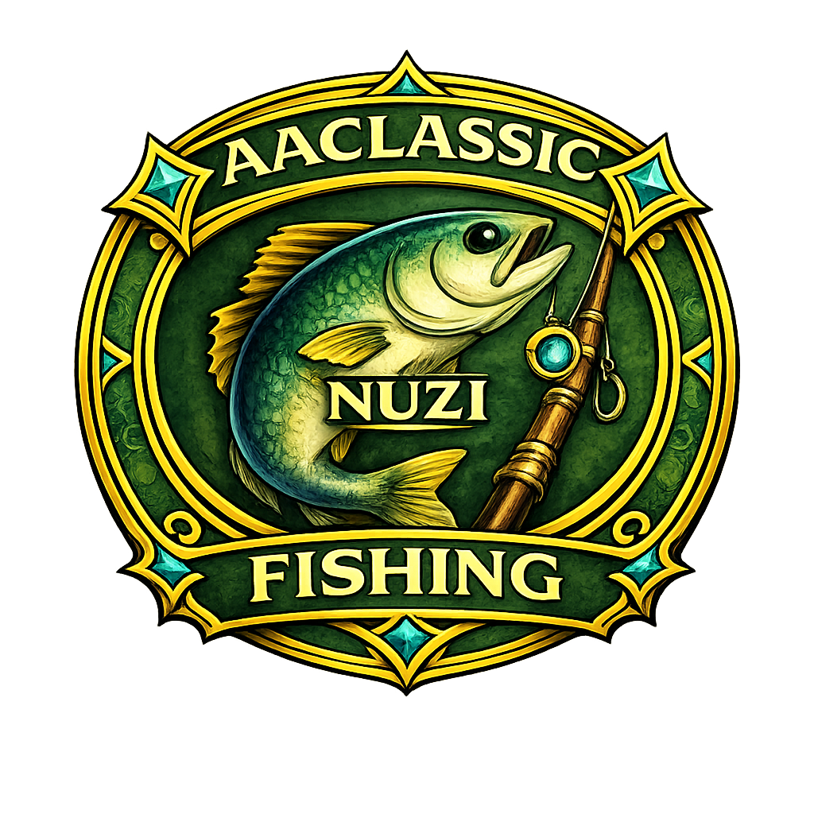

# Nuzi Fishing

Because sport fishing is a lot more fun when the addon is not also fighting you.

`Nuzi Fishing` keeps the important parts in front of you:

- tracks tuna, sturgeon, marlin, sailfish, and sunfish targets
- shows action prompts, timers, hotkey hints, and live coaching text
- tracks catches, session progress, and catch rate
- includes `Full` and `Mini` HUD modes
- uses a movable launcher icon and separate floating session window

## Install

1. Install via Addon Manager.
2. Make sure the addon is enabled in game.
3. Click the launcher icon to open the session panel.

Saved data lives in `nuzi-fishing/.data` so updates do not wipe your session settings.

## Quick Start

1. Target a tracked fish.
2. Let the HUD lock on and show the prompt.
3. Open the session panel with the launcher icon if you want to start logging a fishing run.
4. Use the mode toggle inside the session window to swap between `Full` and `Mini`.

If the target is not one of the tracked fish, the addon stays quiet instead of hallucinating ambition.

## How To

### Fish HUD

The HUD appears when you target a tracked sport fish and the target stays stable briefly.

It can show:

- fish name
- status text
- coach prompt
- coach hint
- timer text
- strength info
- marker and catch tracking
- prompt-specific coaching during the active fish phase

### Session Panel

Click the launcher icon to open the session window.

From there you can:

- start a session
- end a session
- delete saved session rows
- switch HUD mode between `Full` and `Mini`
- resize the HUD and launcher from the settings area

### HUD Modes

- `Full` keeps the full coaching layout visible
- `Mini` trims the HUD down when you want less screen clutter

### Launcher And Settings

The launcher and session window are separate floating widgets.

You can:

- move the launcher icon independently from the session panel
- resize the launcher icon
- move the session panel and settings window with `Shift + drag`

## Notes

- The addon only reacts to targets containing `tuna`, `sturgeon`, `marlin`, `sailfish`, or `sunfish`.
- A short target-stability delay is used to reduce flicker during fast retargeting.
- Session, launcher, and settings window positions are saved through reloads and relogs.
- Settings are stored in `.data/settings.txt` so updates do not ship over someone else's layout.

1.4.7
